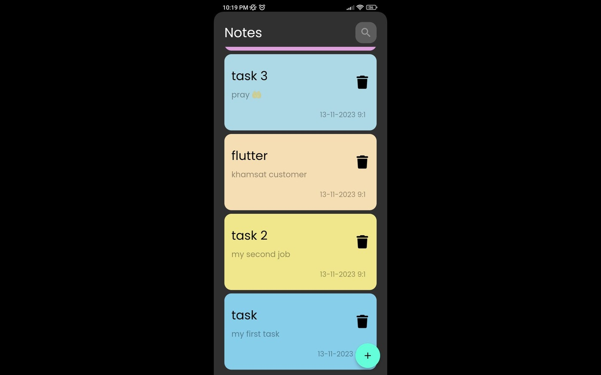
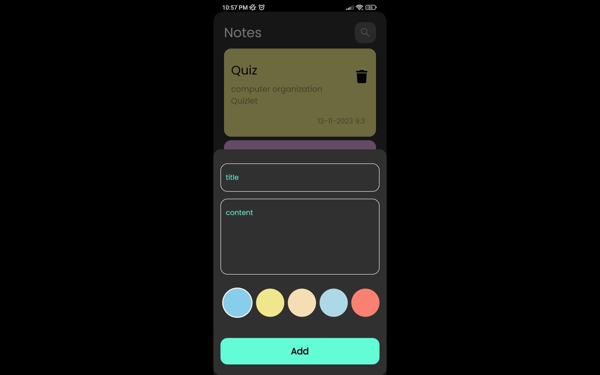
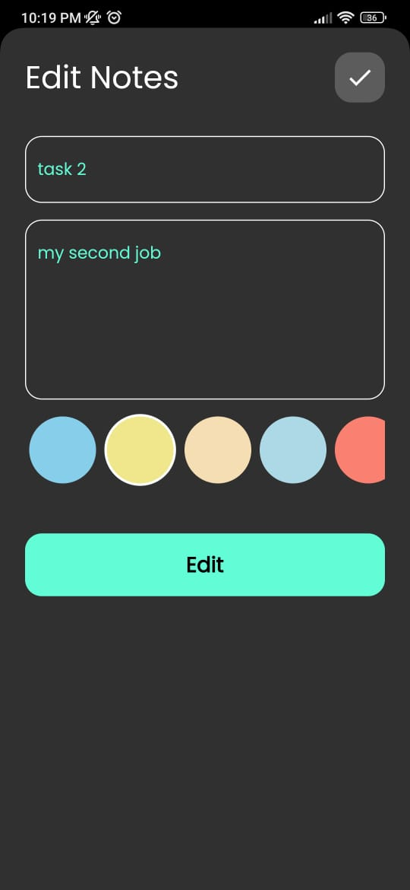

# Note App

Welcome to the Note App Flutter project! This application is designed to provide you with a seamless note-taking experience, whether you're online or offline.

## Overview

The Note App allows you to create, edit, and organize your notes efficiently. Utilizing Flutter and sqflite, this app ensures offline storage, enabling you to access your notes at any time. The app offers features such as color-coded notes, time stamps, and a well-organized view.

## App Screenshots

---
---

---

Feel free to explore the app and enhance your note-taking experience!

---
